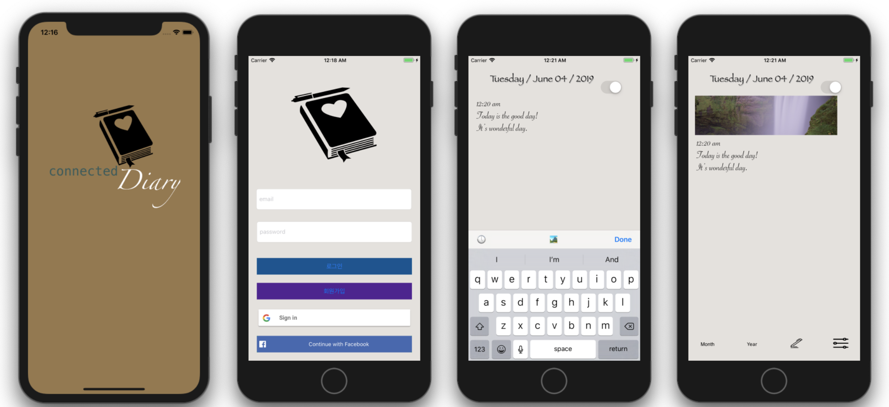

# FastCampusProject

## Fast campus Final Project

[GitHub](https://github.com/Leejoohyeong1/TradeDiary) - Master branch로 Merge 안 되었음

## Trade Diary


[](https://www.youtube.com/embed/wmiG7KTJjuU?t=0s)

[](https://www.youtube.com/embed/wmiG7KTJjuU?t=0s)

<!--```markdown
<iframe width="560" height="315" src="https://www.youtube.com/embed/wmiG7KTJjuU" frameborder="0" allow="accelerometer; autoplay; encrypted-media; gyroscope; picture-in-picture" allowfullscreen></iframe>
```
-->
### Trade Diary란?

* 지인들간의 일기를 서로 교환해서 볼 수 있는 Diary

#### Team Project로 만들어짐.

  - 참여인원 : 3명
  - 기간 : 2018.4.16 - 2018.4.25
  - 주요 기술 (iOS)
  	   - OAuth / google로 Login
  	   - Networking
  	   - UIAlertController
  	   - ImagePicker
  	   - Date Handling

#### My Job: NewPostController, TimeHandler
  - Date & Time Handler
  - Keyboard Tool bar
  - Image Insert (UIImagePickerViewController)
  - Current Time Label Handleing


#### Code

##### Time Handler

```Swift
import Foundation

/// 현재 시간을 불러오기 위한 메서드
/// "3:56 pm" 형식으로 반환
/// - Returns: 현재 시간 값 반환(String type)
func getCurrentTime() -> String {
    let currentTime = Date()
    let timeFormatter = DateFormatter()
    timeFormatter.locale = Locale(identifier: "en_US_POSIX")
    timeFormatter.dateFormat = "h:mm a"
    timeFormatter.amSymbol = "am"
    timeFormatter.pmSymbol = "pm"
    let stringTime = timeFormatter.string(from: currentTime)
    return stringTime
}

func getCurrentDate() -> String {
    let currentDate = Date()
    let dateFormatter = DateFormatter()
    dateFormatter.locale = Locale(identifier: "en_US_POSIX")
    dateFormatter.dateFormat = "EEEE / MMMM dd / yyyy"
    let stringDate = dateFormatter.string(from: currentDate)
    return stringDate
}
```

##### Keyboard ToolBar

```Swift
// MARK: - Keyboard ToolBar Method
extension NewPostViewController {
    
    /// Keyboard TooBar 설정 Method
    private func makeKeyboardToolBar() {
        // Keyboard ToolBar 생성
        let toolBar = UIToolbar()           // Keyboard Toolbar 생성
        toolBar.sizeToFit()
        // toolBar의 버튼 사이 유연공간 마련
        let flexibleSpace = UIBarButtonItem(barButtonSystemItem: UIBarButtonSystemItem.flexibleSpace,
                                            target: nil,
                                            action: nil)
        // Done Button 설정
        let doneButton = UIBarButtonItem(barButtonSystemItem: UIBarButtonSystemItem.done,
                                         target: self,
                                         action: #selector(doneButtonTuched(_:)))
        // 현재 시간 삽입 label 설정
        let timeStampLabel = UIBarButtonItem(title: "🕔",
                                             style: UIBarButtonItemStyle.done,
                                             target: self,
                                             action: #selector(addCurrentTimeLabel))
        
        // Image 추가
        let addImageButton = UIBarButtonItem(title: "🏞",
                                             style: UIBarButtonItemStyle.done,
                                             target: self,
                                             action: #selector(selectImageSource(_:)))
        
        toolBar.setItems([timeStampLabel, flexibleSpace, addImageButton, flexibleSpace, doneButton], animated: false)   // tool Bar에 BarButtonItems 설정
        textView.inputAccessoryView = toolBar // Text View의 inputAccessoryView에 toolBar 설정.
    }
    
    /// Done Button Touch시 키보드 내려감.
    /// Done 버튼 누르면 자동으로 값을 diary 인스턴스에 저장한다.
    /// - Parameter sender: Done buttyon touch
    @objc private func doneButtonTuched(_ sender: Any) {
        self.view.endEditing(true)
        saveDiary(())
        
        let authority = isOpen.isOn ? "1":"2"
        let Contents = textView.text!
        let image :Data? = (self.dailyImageView?.image != nil) ? UIImagePNGRepresentation((self.dailyImageView?.image)!) : nil
        
        if isModifyMode == true {
            //수정
            print("""
            \(authority)
            \(Contents)
            
            """)
            AuthService.init().diaryModify(No: diaryItem.No , uid: diaryItem.Login_uid, authority: authority, Contents: Contents, image: image) { (result) in
                switch result {
                    
                case .success(let value):
                    print(value)
                case .error(_):
                    print("오류")
                }
            }
        } else {
            Service.diaryCreate(uid: Usertoken!, authority: authority, Contents: Contents, image: image!) { (result) in
                switch result {
                case .success(let value):
                    print(value)
                case .error(let error):
                    print(error.localizedDescription)
                }
            }
        }
        self.view.removeFromSuperview()// 리스폰더 체인에서 제거
        self.removeFromParentViewController()//부모로부터 해당 뷰컨을 제거
//        let prevVC = viewControllers.count
//        print(prevVC)
    }
    
    ///  현재 시간을 TextView에 첨부시키는 Method
    @objc private func addCurrentTimeLabel() {
        let timeText: String = getCurrentTime()
        textView.insertText(timeText)
    }
    
    // Keyboard Show Method
    @objc func keyboardWillShow(notification: Notification) {
        if let userInfo = notification.userInfo {
            if let keyboardSize = (userInfo[UIKeyboardFrameBeginUserInfoKey] as? NSValue)?.cgRectValue {
                if hasImage == false {
                    textViewBottomHeight.constant = keyboardSize.height
                } else {
                    textViewBottomHeight.constant = keyboardSize.height + 100
                }
            }
        }
    }
    
    // Keyboard hide Method
    @objc func keyboardWillHide(notification: Notification) {
        textViewBottomHeight.constant = 0.0
    }
}
```

##### Image Picker

```Swift
extension NewPostViewController: UIImagePickerControllerDelegate, UINavigationControllerDelegate {
    // Image Picking
    func imagePickerController(_ picker: UIImagePickerController, didFinishPickingMediaWithInfo info: [String : Any]) {
        let pickedImage = info[UIImagePickerControllerEditedImage] as? UIImage
        //let cropRect = info[UIImagePickerControllerCropRect]!.CGRectValue
        dailyImageView?.image = pickedImage!
        dailyImageView?.contentMode = .scaleAspectFill
        dailyImageView?.layer.masksToBounds = true
        hasImage = true
        self.heightConstraint.constant = self.hasImage ? 115 : 0
        picker.dismiss(animated: false)
    }
    
    // Image Source Type Select Method
    func imgPicker(_ source: UIImagePickerControllerSourceType) {
        let picker = UIImagePickerController()
        picker.sourceType = source
        picker.delegate = self
        picker.allowsEditing = true
        self.present(picker, animated: true, completion: nil)
    }
    // Image Source Types Explain Method
    @objc func selectImageSource(_ sender: Any) {
        self.view.endEditing(true)
        if hasImage == false {
            
            let alert = UIAlertController(title: nil,
                                          message: "Choose Photo Image Source",
                                          preferredStyle: .actionSheet)
            // 카메라
            if UIImagePickerController.isSourceTypeAvailable(.camera) {
                alert.addAction(UIAlertAction(title: "Take Photo",
                                              style: .default,
                                              handler: { (_) in
                    self.imgPicker(.camera)
                }))
            }
            // 저장된 앨범
            if UIImagePickerController.isSourceTypeAvailable(.savedPhotosAlbum) {
                alert.addAction(UIAlertAction(title: "Saved Album",
                                              style: .default,
                                              handler: { (_) in
                    self.imgPicker(.savedPhotosAlbum)
                }))
            }
            // Photo Library
            if UIImagePickerController.isSourceTypeAvailable(.photoLibrary) {
                alert.addAction(UIAlertAction(title: "Photo Library",
                                              style: .default,
                                              handler: { (_) in
                    self.imgPicker(.photoLibrary)
                }))
            }
            // Cancel Button
            alert.addAction(UIAlertAction(title: "Cancel",
                                          style: .cancel,
                                          handler: nil))
            
            // ActionSheet 창 실행
            self.present(alert, animated: true, completion: nil)
        } else {
            deleteImageView()
        }
    }
    
}
```

##### Gesture handling

```Swift
// MARK: - Gesture Method
extension NewPostViewController: UIGestureRecognizerDelegate {
    // 이미지를 Tap하면 전체화면으로 사진이 변경되는 메서드
    func gestureRecognizer(_ gestureRecognizer: UIGestureRecognizer, shouldReceive touch: UITouch) -> Bool {
        // print("tapped")
        let fullImageView = UIImageView()
        fullImageView.frame = CGRect(x: 0,
                                     y: 0 - UIApplication.shared.statusBarFrame.height,
                                     width: self.view.frame.size.width,
                                     height: UIScreen.main.bounds.height )
        UIApplication.shared.statusBarView?.isHidden = true
        fullImageView.image = dailyImageView?.image
        fullImageView.contentMode = .scaleAspectFill
        fullImageView.isUserInteractionEnabled = true
        let tap = UITapGestureRecognizer(target: self, action: #selector(dismissFullScreenImage(_:)))
        fullImageView.addGestureRecognizer(tap)
        self.view.addSubview(fullImageView)
        return true
    }
    
    // 전체화면으로 확대된 사진에서 원래 화면으로 복귀하는 메서드
    @objc func dismissFullScreenImage(_ sender: UIGestureRecognizer) {
        sender.view?.removeFromSuperview()
        UIApplication.shared.statusBarView?.isHidden = false
    }

    // 이미지를 지우는 메서드
    func deleteImageView() {
        let alert = UIAlertController(title: nil,
                                      message: "Do you want to delete photo?",
                                      preferredStyle: .actionSheet)
        let deleteAction = UIAlertAction(title: "Delete", style: .default) { (_) in
            self.hasImage = false
            self.dailyImageView?.image = nil
            self.heightConstraint.constant = self.hasImage ? 115 : 10
            let data = DiaryData()
            data.image = nil
        }
        
        let cancel = UIAlertAction(title: "Cancel", style: .cancel, handler: nil)
        alert.addAction(deleteAction)
        alert.addAction(cancel)
        self.present(alert, animated: false, completion: nil)
    }
}
```


